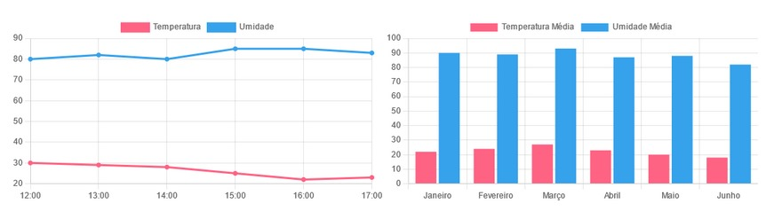

# Atividade Chart.js

Atividade acadêmica da faculdade **SPTech**, com o objetivo de criar uma página HTML utilizando a biblioteca **Chart.js** para desenvolver uma dashboard simples, conforme a referência disponibilizada no enunciado.

## Objetivo

Criar uma dashboard contendo dois gráficos:

- **Gráfico de linhas:** apresenta a variação de temperatura e umidade ao longo do dia.
- **Gráfico de barras:** apresenta as médias de temperatura e umidade de janeiro a junho.

Foi utilizado **HTML, CSS e JavaScript**, com a biblioteca **Chart.js** para a criação dos gráficos.

## Dashboard

  

## Dados utilizados

### Gráfico de Linhas

| Horário | Temperatura | Umidade |
| ------- | ----------- | ------- |
| 12:00 | 30 | 80 |
| 13:00 | 29 | 82 |
| 14:00 | 28 | 80 |
| 15:00 | 25 | 85 |
| 16:00 | 22 | 80 |
| 17:00 | 23 | 83 |

### Gráfico de Barras

| Mês | Temperatura Média | Umidade Média |
| --- | ----------------- | ------------- |
| Janeiro | 22 | 90 |
| Fevereiro | 24 | 89 |
| Março | 27 | 93 |
| Abril | 23 | 87 |
| Maio | 20 | 88 |
| Junho | 18 | 82 |

## Estrutura

O projeto utiliza:

- `index.html` para a estrutura da página;
- `style.css` para a organização e estilização dos gráficos;
- JavaScript com **Chart.js** para gerar as visualizações.

Os gráficos foram organizados lado a lado utilizando **Flexbox**, permitindo uma visualização mais adequada da dashboard.

## Referência

A atividade foi baseada no enunciado e na imagem de referência disponibilizados no Moodle da SPTech.